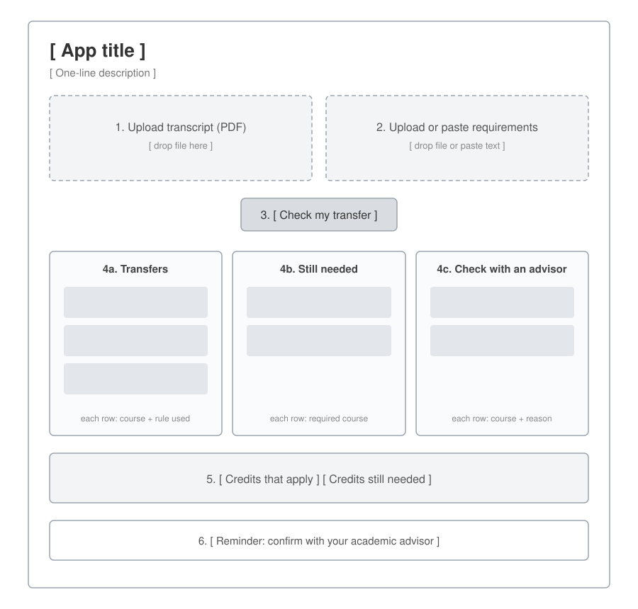
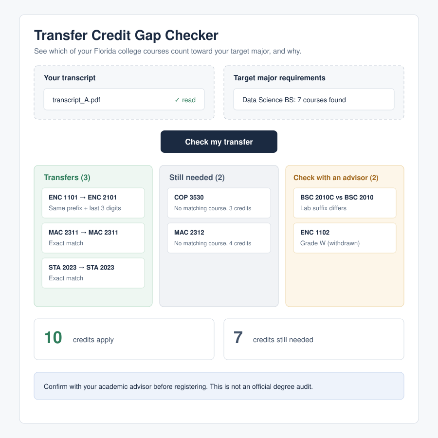

# Design

## 1. The screen (app.py)
1. Upload transcript (PDF).
2. Upload or paste target major's requirements.
3. Button: "Check my transfer."
4. Results in three groups: Transfers, Still needed, Check with an advisor.
5. Credit totals.
6. Reminder: "Confirm with your academic advisor before registering."

**Wireframe:** 

**Mockup:** 

## 2. One course as data
| Field | Example |
|-------|---------|
| prefix | ENC |
| number | 1101 |
| suffix | C, L, or empty |
| credits | 3 |
| grade | A, W, or empty |

## 3. The one AI call (extractor.py)
- Input: text of one uploaded document.
- Output: a list of courses in the format above (JSON).
- The AI only reads. It never decides what transfers.

## 4. The logic (matcher.py), plain code
- `verify_in_text`: is this code really in the document? If not, mark "Unverified."
- `courses_match`: same prefix and same last 3 digits?
- `classify`: sort each requirement into Transfers, Still needed, or Check with an advisor.
- `credit_totals`: add up credits that apply and credits still needed.

## 5. The flow
Upload → AI extracts courses → code verifies → code matches → results on screen.

## 6. Tech stack
| Need | Choice | Why |
|------|--------|-----|
| Language | Python 3.12 | Familiar from my data science BSc |
| Web page | Streamlit | One Python file makes a web app; upload built in |
| AI | Claude API | Reads documents and returns structured JSON |
| Reading PDFs | pypdf | Pulls text out of PDF files |
| Tests | pytest | Standard Python testing tool |
| Automatic testing | GitHub Actions | Runs tests on every push (CI) |
| Hosting | Streamlit Community Cloud | Free, deploys straight from GitHub |

## 7. Files and folders
| File | Job |
|------|-----|
| `app.py` | The screen |
| `extractor.py` | The one AI call |
| `matcher.py` | Matching logic (plain code) |
| `tests/test_matcher.py` | Automated tests |
| `tests/data/` | Fake transcripts and requirement lists |
| `requirements.txt` | Libraries to install |
| `.env` | Real API key (never committed) |

## 8. When things go wrong
- PDF has no readable text → show "Couldn't read text from this file."
- AI returns something that isn't valid JSON → show "Couldn't read courses. Try again."
- AI returns a course not in the document → mark it "Unverified."
- No API key found → show "API key missing. Check your .env file."

---
Drafted with Claude; reviewed and edited by Harsh. See docs/ai-log.md.